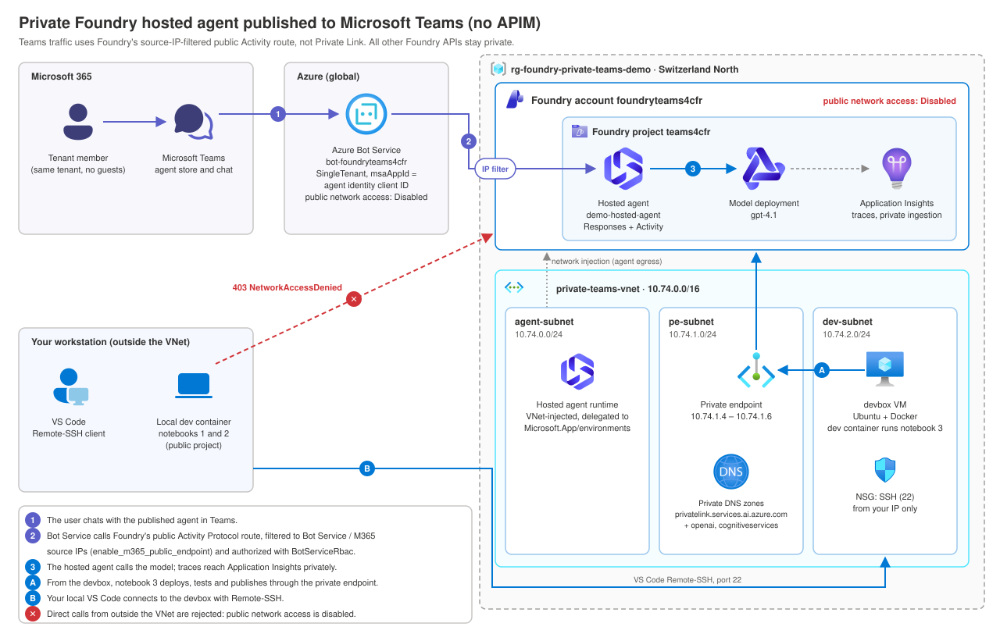

# Microsoft Foundry Demo Notebooks

Four notebooks explore Microsoft Foundry: model calls and managed prompt agents, custom hosted agents with long-running workflows, observability and gateway controls, publishing a hosted agent from a **private-network** Foundry project to Microsoft Teams without APIM, and prompt caching.

These are hands-on presentation demos, not production application templates. Notebook headings reference slides in an accompanying presentation; the notebooks can also be explored independently. Preview features and cells marked `# verify` should be checked against the linked documentation and your deployed SDK versions before presenting.

## Choose a Notebook

| Notebook | Focus | What you demonstrate |
| --- | --- | --- |
| [Notebook 1: Foundry platform features](foundry-demo.ipynb) | Call models and assemble a managed prompt agent | Model Router, priority processing, toolboxes, conversations, memory, tracing, evaluation, and guardrails |
| [Notebook 2: Hosted agents and operations](foundry-demo-2-hosted-agents.ipynb) | Interact with services deployed beforehand | Custom agent code, a procurement briefing workflow, background execution, steering, recovery, telemetry, and an API Management gateway |
| [Notebook 3: Private hosted agent to Teams](foundry-demo-3-hosted-agent-private-nework.ipynb) | Provision a private Foundry project and publish to Teams | VNet-injected Foundry, private endpoint access, azd source deployment, Azure Bot Service, the Activity Protocol route, and Microsoft 365 publishing |
| [Notebook 4: Prompt caching](foundry-demo-4-promp-caching.ipynb) | Observe cache reads and writes on the public project | Cold/warm calls, prefix sensitivity, prompt layout, append-only history, explicit breakpoints with `prompt_cache_key`, and reuse ratios |

## Notebook 1: Platform Features

[foundry-demo.ipynb](foundry-demo.ipynb) uses a Foundry project client and its OpenAI-compatible client to explore the platform incrementally.

| Section | Functionality |
| --- | --- |
| Connect | Authenticate with `DefaultAzureCredential` and connect to a Foundry project without embedding an API key. |
| Model calls and routing | Call a chat deployment, then a Model Router deployment through the Responses API. |
| Priority processing | Compare requests using different service tiers and inspect elapsed time. This is a demonstration, not a controlled latency benchmark. |
| Toolboxes and prompt agents | Create a versioned toolbox with web search, tool search, Microsoft Learn MCP, and Foundry IQ MCP connections. Inspect exposed tools, promote the toolbox version, and attach it to a prompt agent. |
| Conversations | Send multiple turns on one conversation and inspect stored messages and tool-related items. |
| Memory | Create a memory store backed by chat and embedding deployments, attach a memory tool to a new agent version, and test preference recall across separate conversations. |
| Tracing | Obtain the project's Application Insights connection string, instrument the client, and send a traced request. Message-content capture is disabled in the example. |
| Evaluation | Upload a small JSONL dataset, evaluate the agent using task-adherence, coherence, and safety criteria, poll the run, and obtain a report URL. |
| Guardrails | Submit a normal request and a prompt-injection test, then inspect the response or content-filter error. Actual behavior depends on assigned policies. |

**Before running:** replace the project resource ID and the Microsoft Learn / Foundry IQ connection IDs embedded in the toolbox and role-assignment cells. Those values are specific to the original demo environment; changing only the project endpoint is not enough. The knowledge connections and their underlying content must already be configured.

The notebook creates cloud artifacts and includes a role-assignment command. Review these cells before executing them. Resource-creation cells are not necessarily idempotent, and rerunning them can create new versions or conflict with existing names.

**Memory caveat:** the fixed wait in the demo does not prove that asynchronous memory extraction has finished. Verify the stored preference, scope, and agent version when investigating failed recall; a successful cell execution alone does not prove that memory was used.

## Notebook 2: Hosted Agents and Operations

[foundry-demo-2-hosted-agents.ipynb](foundry-demo-2-hosted-agents.ipynb) calls two hosted services. Deploy them first using the instructions in [agent/README.md](agent/README.md).

### Hosted Agent

`demo-hosted-agent` is an Agent Framework assistant with a deployment-type hint function. The notebook calls its dedicated Responses endpoint, displays the reply and output-item types, and inspects agent versions and available identity information.

Hosted-agent calls use the agent-specific endpoint, not the project-level `agent_reference` invocation used for prompt agents in notebook 1. Hosted conversations are also created on the hosted agent's own endpoint.

### Long-Running Procurement Brief

`demo-long-running-agent` supports a procurement manager preparing a sourcing decision for a Swiss manufacturer launching a battery-storage product in six months. It makes three sequential model calls and produces:

1. **Risk assessment:** prioritized risks, business impacts, assumptions, and missing evidence.
2. **Mitigation plan:** sourcing options, accountable roles, and decision gates.
3. **Executive decision brief:** a conditional recommendation, trade-offs, and next actions for human approval.

The initial request compares single-source and dual-source battery-module sourcing. An optional steering request redirects the work to battery-recycling partner selection while the original response is still active. The notebook renders completed sections as Markdown rather than printing raw response JSON.

**Why use a long-running agent?** Multi-stage analysis and review can outlast a single interactive request. Background execution lets the user disconnect and return. Checkpoints preserve completed sections so recovery can reuse them. Steering stops unfinished work when the business priority changes. A short, one-step summary generally does not need this architecture.

| Capability | Behavior in this demo |
| --- | --- |
| Background execution | Submit a stored background response and poll its ID while work continues independently of the client. |
| Steering | Queue a new instruction on the same hosted conversation and cooperatively stop the original turn. The new turn produces a separate brief. |
| Checkpoint recovery | Commit each completed section with `stream.checkpoint()` and restore its content and original item ID on recovery. Uncommitted work may be repeated. |
| Reconnection | Rerun the polling cell to retrieve the same response after the notebook's polling deadline. |
| Local crash demonstration | Set `SIMULATE_CRASH_AFTER_STAGE=0`, run locally, and restart after the first checkpoint. See the agent guide for the local workflow. |

**Limits:** the agent has no live supplier, pricing, or regulatory sources. It produces preliminary analysis using supplied facts and model knowledge, not verified due diligence. Humans must validate evidence and approve decisions. It does not approve suppliers or place orders.

The deployment manifest includes a **10-second presentation-only delay per stage** to leave time for steering. Set `DEMO_STAGE_DELAY_SECONDS` to `0` for normal use. Model latency is additional and varies.

### Telemetry and AI Gateway

- **Telemetry:** query Application Insights `dependencies` and `requests` for recent agent activity, including model calls and storage operations. The cell reports timestamps, role names, operation names, duration, success, and correlation IDs.
- **Optional local telemetry:** the notebook describes an Aspire Dashboard view for locally hosted agents.
- **AI gateway:** call a model through an existing Azure API Management gateway, exercise a configured token-limit policy, and inspect HTTP `429` / `Retry-After` behavior and token metrics.

The gateway is not provisioned by these notebooks. Its API path, backend authentication, subscription, policies, and telemetry destination must be configured separately. Verify the imported API's path and the token-metric query against your gateway; it may use a different Application Insights resource from the agents.

## Notebook 3: Private Hosted Agent to Teams

[foundry-demo-3-hosted-agent-private-nework.ipynb](foundry-demo-3-hosted-agent-private-nework.ipynb) follows [Publish agents to Microsoft 365 and Teams by using the REST API](https://learn.microsoft.com/azure/foundry/agents/how-to/publish-copilot-virtual-network) using the native `azure-ai-projects` SDK. It creates a separate private Foundry environment; it does not touch the public project used by notebooks 1 and 2.



The Foundry account keeps **public network access disabled**. Teams traffic does **not** use Private Link: `enable_m365_public_endpoint` opens only the agent's Activity Protocol route to Azure Bot Service and Microsoft 365 source IPs, and `BotServiceRbac` still requires a same-tenant user with Foundry permissions. Management, deployment, Responses, and publishing calls go through the private endpoint, so they must run from inside the VNet.

| Section | Functionality |
| --- | --- |
| Configuration | Read the `PRIVATE_DEMO_*` settings from `.env` and create Azure SDK clients. |
| Infrastructure | Compile the pinned [sample 11](https://github.com/microsoft-foundry/foundry-samples/tree/main/infrastructure/infrastructure-setup-bicep/11-private-network-basic-vnet) Bicep (VNet injection, private endpoint and DNS, model, private telemetry) and deploy it with the SDK. Reruns only read the deployment outputs. Assign **Foundry User** on the new project. |
| Connectivity gate | Confirm public network access is disabled and the project API is reachable privately. |
| Deploy and test | Deploy the existing `demo-hosted-agent` source with the isolated [azd manifest](private-agent/azure.yaml) (`codeConfiguration`, no ACR), then call it through `project.get_openai_client(agent_name=...)`. |
| Doc steps 1–2 | Read the agent identity client ID and create a single-tenant Azure Bot Service with a Teams channel. |
| Doc step 3 | `project.agents.update_details(...)`: keep `responses` + `Entra`, add `activity` with `enable_m365_public_endpoint` + `BotServiceRbac`. |
| Doc step 4 | `project.agents.publish_to_microsoft365(...)` with `Shared` scope; returns a `title_id`. |
| Prove and clean up | Chat in Teams, confirm a call from outside the VNet gets `403 NetworkAccessDenied`, and optionally delete the resource group. |

### Private connectivity with a devbox VM

A dev container shares its host's network, so the local container cannot reach the private endpoint. Run notebook 3 from a small VM in a non-delegated subnet of the same VNet; Azure DNS resolves the linked private DNS zones automatically. Notebooks 1 and 2 keep running locally.

1. Provision the infrastructure (notebook 3, cells 3 and 5); these are management-plane calls and work from anywhere.
2. Create the devbox (replace the SSH public key with your own; SSH is allowed only from your current IP):

   ```bash
   RG=rg-foundry-private-teams-demo
   az network vnet subnet create -g $RG --vnet-name private-teams-vnet -n dev-subnet --address-prefixes 10.74.2.0/24
   az vm create -g $RG -n devbox --image Ubuntu2404 --size Standard_D4s_v5 \
     --vnet-name private-teams-vnet --subnet dev-subnet --admin-username azureuser \
     --ssh-key-values "<your ssh-ed25519 public key>" --public-ip-sku Standard --nsg-rule NONE
   az network nsg rule create -g $RG --nsg-name devboxNSG -n allow-ssh-my-ip --priority 1000 \
     --direction Inbound --access Allow --protocol Tcp --destination-port-ranges 22 \
     --source-address-prefixes "$(curl -s https://api.ipify.org)/32"
   az vm run-command invoke -g $RG -n devbox --command-id RunShellScript \
     --scripts "curl -fsSL https://get.docker.com | sh && usermod -aG docker azureuser && apt-get install -y git"
   ```

3. Commit and push your changes: the VM clones the repository, and the [dev container](.devcontainer/devcontainer.json) comes with it.
4. In **local** VS Code, run **Remote-SSH: Connect to Host…** with `azureuser@<devbox-public-ip>`. No jumpbox is needed.
5. On the VM, clone the repository, open the folder, create `.env` (it is gitignored), and run **Dev Containers: Reopen in Container**.
6. In the container, run `az login` and `azd auth login`, check that `getent hosts <account>.services.ai.azure.com` returns a `10.74.1.x` address, then run notebook 3 from cell 3 onward.

If your public IP changes, update the `allow-ssh-my-ip` rule. Deallocate the VM when idle: `az vm deallocate -g rg-foundry-private-teams-demo -n devbox`. If policy forbids a public IP with SSH, use Azure Bastion (Standard SKU, native client) or a point-to-site VPN with private DNS resolution instead.

**Publishing notes:** replace the Contoso developer metadata before publishing. Republishing the same `app_version` fails. The Teams catalog can take about an hour to show the agent under **Your agents**. Remove the app from Teams before deleting Azure resources; resource deletion does not clean up the Microsoft 365 catalog.

## Prerequisites

- An Azure subscription and an existing Foundry project with appropriate feature and regional availability.
- A chat-model deployment; a Model Router deployment for the routing demo; an embedding deployment for memory.
- A Python notebook environment. Python 3.12 has been used for notebook execution; hosted services are configured with Python 3.13 in [agent/azure.yaml](agent/azure.yaml).
- Azure CLI authentication usable by `DefaultAzureCredential`. Deploying services and creating notebook toolbox connections also require Azure Developer CLI and the relevant Foundry extensions, described in the agent guide.
- Permissions to invoke models and manage the demo resources. The role-assignment cell additionally requires permission to assign roles, and querying telemetry requires log-read access.
- Application Insights connected to the project for tracing, and configured knowledge connections for the notebook 1 toolbox examples.
- An existing API Management gateway only if you run the gateway section.

## Local Setup

From the repository root, install the shared dependencies into the Python environment selected by your notebook kernel:

```bash
python3 -m pip install -r requirements.txt
```

[requirements.txt](requirements.txt) includes both hosted-agent requirement files, so it is the shared entry point for local dependencies. The separate service requirement files remain necessary for deployment.

Use [.env.example](.env.example) as the starting point for a root-level `.env`. Replace placeholders with deployment names and resource values for your environment. Do not commit credentials or populated environment files.

| Variable | Used for |
| --- | --- |
| `FOUNDRY_PROJECT_ENDPOINT` | Notebooks 1, 2 and 4: `https://<account>.services.ai.azure.com/api/projects/<project>` |
| `FOUNDRY_MODEL_NAME` | Chat deployment in notebooks 1, 2 and 4 (notebook 4's demo 5 needs GPT-5.6 or later on Standard) |
| `FOUNDRY_ROUTER_NAME` | Notebook 1 Model Router deployment |
| `FOUNDRY_EMBEDDING_NAME` | Notebook 1 memory embedding deployment |
| `HOSTED_AGENT_NAME` | Notebook 2 hosted assistant; defaults to `demo-hosted-agent` |
| `LONG_RUNNING_AGENT_NAME` | Notebook 2 briefing agent; defaults to `demo-long-running-agent` |
| `APP_INSIGHTS_RESOURCE_ID` | Notebook 2 telemetry: full Application Insights component resource ID |
| `APIM_GATEWAY_URL` | Optional gateway section: gateway URL including the imported API suffix |
| `APIM_SUBSCRIPTION_KEY` | Optional gateway section: subscription key authorized for that API |
| `PRIVATE_DEMO_*` | Notebook 3 only: subscription, resource group, region, account/project/VNet base names, address ranges, model, azd environment, deployment name, and optional user object ID. Kept separate from the public settings above. |

The gateway variables must be added separately if they are absent from the example file. The notebook builds the gateway client URL by appending `/v1`; confirm that this matches your imported API.

For telemetry, use this resource-ID shape:

```text
/subscriptions/<subscription>/resourceGroups/<group>/providers/Microsoft.Insights/components/<app-insights-name>
```

Do **not** use the Foundry connection ID ending in `/projects/.../connections/...`, an instrumentation key, or an Application ID. The telemetry cell validates the resource type and rereads its setting from `.env`.

The hosted services use a separate deployment setting, `AZURE_AI_MODEL_DEPLOYMENT_NAME`, configured in the **azd environment**. Setting `FOUNDRY_MODEL_NAME` in the notebook's `.env` does not replace that deployment configuration. Follow [agent/README.md](agent/README.md) for provisioning and deployment.

## Recommended Demo Flow

1. Complete local setup and authenticate. Review notebook 1's environment-specific IDs and resource-creation cells.
2. Run notebook 1 section by section: model calls, tools, conversations, memory, then observability. Evaluation and guardrail tests can be explored separately after agent setup.
3. Deploy the two hosted services following the agent guide before opening notebook 2's hosted-agent sections.
4. In notebook 2, connect and invoke the hosted assistant. Run the briefing start cell, then promptly run steering while the first turn is active, followed by the polling cell. Skip steering to finish the original sourcing brief.
5. Inspect the completed deliverable and telemetry. Run the optional gateway section only after configuring API Management.
6. For notebook 3, provision the private infrastructure locally, then switch to the devbox VM for the connectivity gate, agent deployment, and Teams publishing.

Avoid blindly using **Run All**: steering is timing-sensitive, some cells modify Azure resources, and notebook 1 ends with a destructive cleanup cell. Repeated setup can also change which agent version subsequent name-only references select.

## Costs, Validation, and Cleanup

Model calls, evaluations, hosted compute, telemetry ingestion, and gateway resources can incur charges. A completed procurement brief normally uses three model calls; retries and uncheckpointed recovery can add usage. Cancelling a local request does not guarantee that upstream model computation or billing stops immediately.

The long-running agent includes focused local tests for stage chaining, recovery, cancellation, shutdown, and model-client behavior:

```bash
OTEL_SDK_DISABLED=true python3 -m unittest discover -s agent/src/demo-long-running-agent -p 'test_*.py'
```

These tests do not validate Azure permissions, model quality, gateway policies, or real crash recovery in your deployment. Preview APIs, guardrail results, memory timing, and evaluation configuration should be rehearsed in the target environment.

Notebook 1's cleanup cell deletes its memory store; agent and toolbox deletion examples are commented out. It is not a comprehensive cleanup of conversations, datasets, evaluations, connections, or role assignments. Review created artifacts explicitly after the demo.

For hosted resources, follow the agent guide and review the selected azd environment before using `azd down`. Review separately managed resources such as API Management separately; do not assume the notebook cleanup removes all chargeable resources.

Notebook 3's private environment (VNet, private endpoint, model, hosted compute, Bot Service, telemetry, and the devbox VM) is billable while it exists. Its last cell deletes the whole dedicated resource group, including the devbox. If a capability host blocks subnet reuse, follow the pinned sample's cleanup guidance.

## Repository Guide

- [foundry-demo.ipynb](foundry-demo.ipynb): platform features and managed prompt-agent lifecycle.
- [foundry-demo-2-hosted-agents.ipynb](foundry-demo-2-hosted-agents.ipynb): hosted services, procurement brief, telemetry, and gateway.
- [foundry-demo-3-hosted-agent-private-nework.ipynb](foundry-demo-3-hosted-agent-private-nework.ipynb): private Foundry infrastructure and Teams publishing.
- [foundry-demo-4-promp-caching.ipynb](foundry-demo-4-promp-caching.ipynb): prompt caching measured through the project's Responses API.
- [private-agent/azure.yaml](private-agent/azure.yaml): isolated azd manifest deploying `demo-hosted-agent` to the private project.
- [docs/private-teams-architecture.svg](docs/private-teams-architecture.svg): notebook 3 architecture diagram (official Azure and Microsoft 365 icons).
- [requirements.txt](requirements.txt): shared local dependencies.
- [.env.example](.env.example): notebook configuration template.
- [agent/README.md](agent/README.md): hosted-agent setup, deployment, and local operations.
- [agent/azure.yaml](agent/azure.yaml): existing project binding and hosted-service definitions.
- [agent/src/demo-hosted-agent/main.py](agent/src/demo-hosted-agent/main.py): Agent Framework assistant with a function tool.
- [agent/src/demo-long-running-agent/main.py](agent/src/demo-long-running-agent/main.py): checkpointed procurement-briefing workflow.