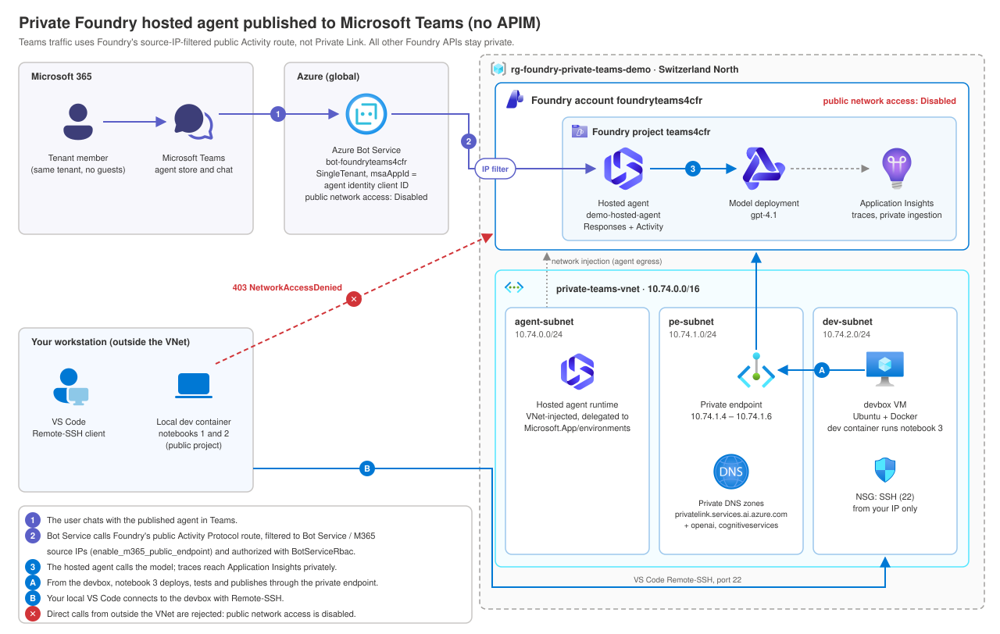
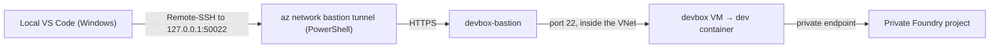
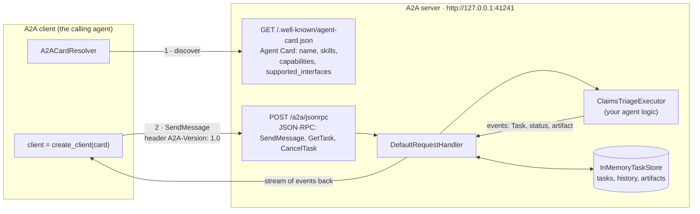
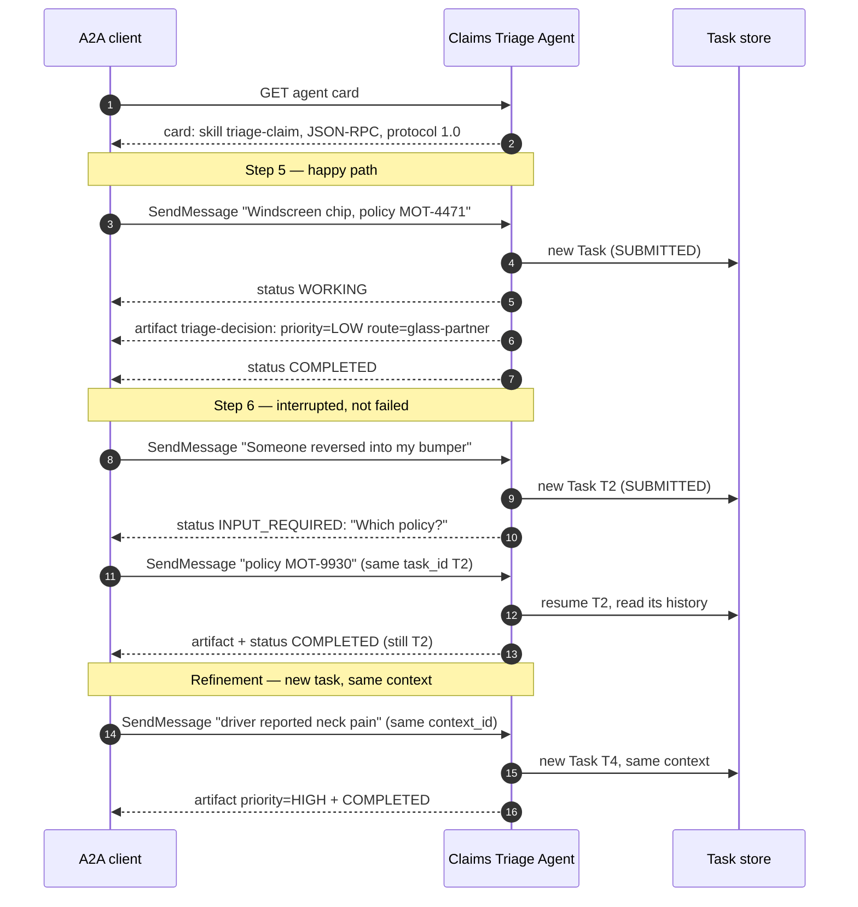
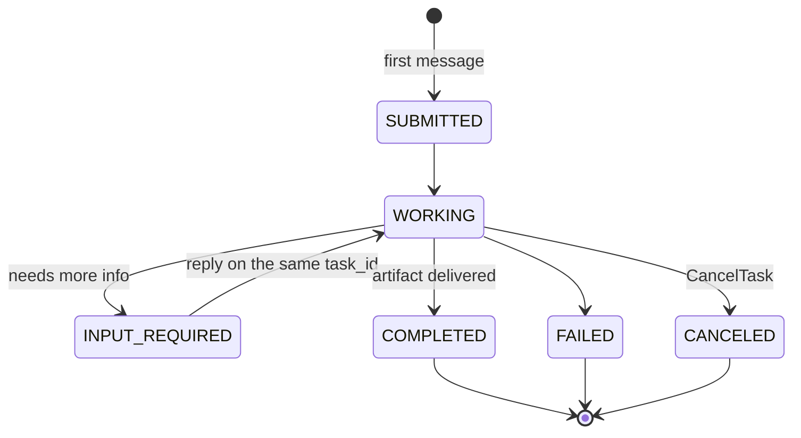
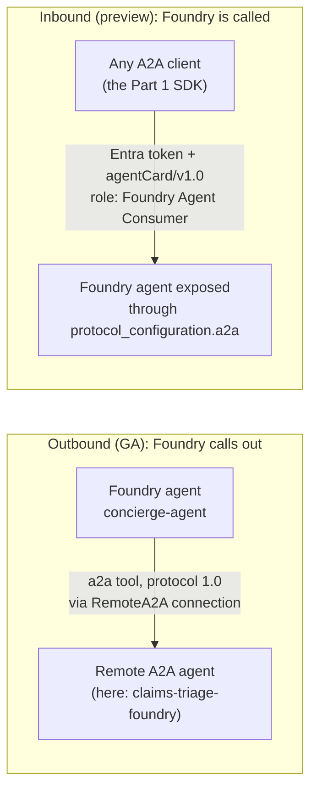
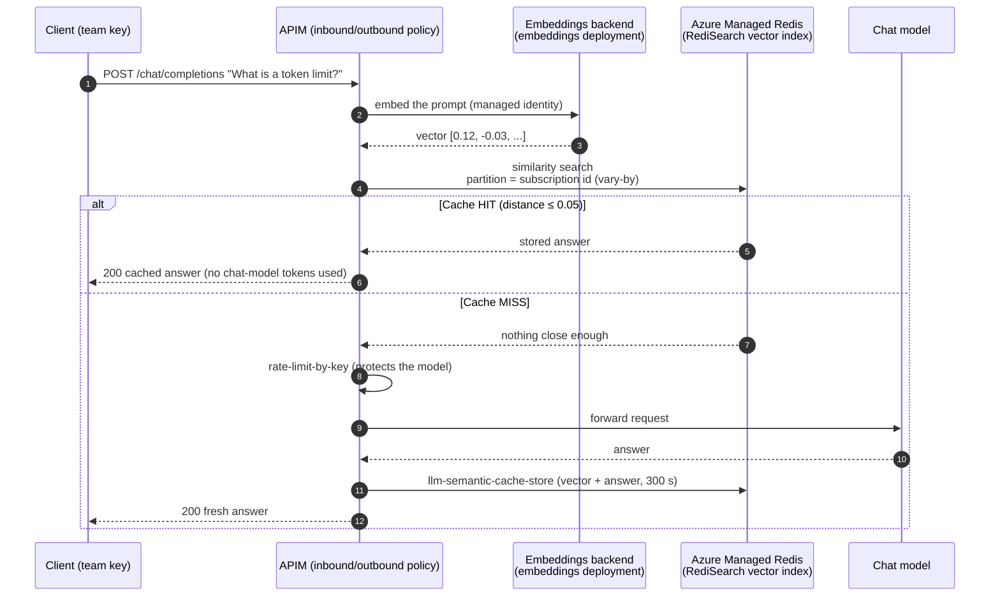

# Microsoft Foundry Demo Notebooks

Eight notebooks explore Microsoft Foundry: model calls and managed prompt agents, custom hosted agents with long-running workflows, observability and gateway controls, publishing a hosted agent from a **private-network** Foundry project to Microsoft Teams without APIM, prompt caching, the Agent2Agent (A2A) protocol, Azure Content Understanding, Voice Live with voice agents, and governing models, tools and agents with an AI gateway.

These are hands-on presentation demos, not production application templates. Notebook headings reference slides in an accompanying presentation; the notebooks can also be explored independently. Preview features and cells marked `# verify` should be checked against the linked documentation and your deployed SDK versions before presenting.

## Choose a Notebook

| Notebook | Focus | What you demonstrate |
| --- | --- | --- |
| [Notebook 1: Foundry platform features](foundry-demo-1-what-is-new.ipynb) | Call models and assemble a managed prompt agent | Model Router, priority processing, toolboxes, conversations, memory, tracing, evaluation, and guardrails |
| [Notebook 2: Hosted agents and operations](foundry-demo-2-hosted-agents.ipynb) | Interact with services deployed beforehand | Custom agent code, a procurement briefing workflow, background execution, steering, recovery, telemetry, and an API Management gateway |
| [Notebook 3: Private hosted agent to Teams](foundry-demo-3-hosted-agent-private-nework.ipynb) | Provision a private Foundry project and publish to Teams | VNet-injected Foundry, private endpoint access, azd source deployment, Azure Bot Service, the Activity Protocol route, and Microsoft 365 publishing |
| [Notebook 4: Prompt caching](foundry-demo-4-promp-caching.ipynb) | Observe cache reads and writes on the public project | Cold/warm calls, prefix sensitivity, prompt layout, append-only history, explicit breakpoints with `prompt_cache_key`, and reuse ratios |
| [Notebook 5: Agent2Agent (A2A)](foundry-demo-5-a2a.ipynb) | Run an A2A 1.0 server and client locally, then configure A2A in Foundry | Agent Card discovery, tasks and their states, input-required and resume, artifacts, wire format, the outbound `a2a` tool, and the inbound A2A endpoint |
| [Notebook 6: Content Understanding](foundry-demo-6-content-understanding.ipynb) | Build an accounts-payable document pipeline one capability at a time | Markdown extraction, prebuilt invoice fields, a custom analyzer, confidence-based straight-through processing, classification and segmentation, and the preview agentic workflow and inline analysis |
| [Notebook 7: Voice Live and voice agents](foundry-demo-7-voice-live.ipynb) | Build an IT service-desk voice assistant step by step | Voice Live sessions, voices, turn detection, model choice, function tools, voice in front of a Foundry agent, and preview Foundry voice agents with stored conversations |
| [Notebook 8: AI gateway governance](foundry-demo-8-ai-gateway-governance.ipynb) | Govern an existing API Management instance in front of Foundry | Per-team token limits and quotas, usage attribution, content safety, semantic caching, backend pools, MCP and A2A governance, AI Gateway in Foundry, and end-to-end tracing |

## Notebook 1: Platform Features

[foundry-demo-1-what-is-new.ipynb](foundry-demo-1-what-is-new.ipynb) uses a Foundry project client and its OpenAI-compatible client to explore the platform incrementally.

| Section | Functionality |
| --- | --- |
| Connect | Authenticate with `DefaultAzureCredential` and connect to a Foundry project without embedding an API key. |
| Model calls and routing | Call a chat deployment, then a Model Router deployment through the Responses API. |
| Priority processing | Compare requests using different service tiers and inspect elapsed time. This is a demonstration, not a controlled latency benchmark. |
| Toolboxes and prompt agents | Create a versioned toolbox with web search, tool search, Microsoft Learn MCP, and Foundry IQ MCP connections. Inspect exposed tools, promote the toolbox version, and attach it to a prompt agent. |
| Conversations | Send multiple turns on one conversation and inspect stored messages and tool-related items. |
| Memory | Create a memory store backed by chat and embedding deployments, attach a memory tool to a new agent version, and test preference recall across separate conversations. |
| Tracing | Obtain the project's Application Insights connection string, instrument the client, and send a traced request. Message-content capture is disabled in the example. |
| Evaluation | Upload a small JSONL dataset, evaluate the agent using task-adherence, coherence, and safety criteria, poll the run, and obtain a report URL. |
| Guardrails | Submit a normal request and a prompt-injection test, then inspect the response or content-filter error. Actual behavior depends on assigned policies. |

**Before running:** replace the project resource ID and the Microsoft Learn / Foundry IQ connection IDs embedded in the toolbox and role-assignment cells. Those values are specific to the original demo environment; changing only the project endpoint is not enough. The knowledge connections and their underlying content must already be configured.

The notebook creates cloud artifacts and includes a role-assignment command. Review these cells before executing them. Resource-creation cells are not necessarily idempotent, and rerunning them can create new versions or conflict with existing names.

**Memory caveat:** the fixed wait in the demo does not prove that asynchronous memory extraction has finished. Verify the stored preference, scope, and agent version when investigating failed recall; a successful cell execution alone does not prove that memory was used.

## Notebook 2: Hosted Agents and Operations

[foundry-demo-2-hosted-agents.ipynb](foundry-demo-2-hosted-agents.ipynb) calls two hosted services. Deploy them first using the instructions in [agent/README.md](agent/README.md).

### Hosted Agent

`demo-hosted-agent` is an Agent Framework assistant with a deployment-type hint function. The notebook calls its dedicated Responses endpoint, displays the reply and output-item types, and inspects agent versions and available identity information.

Hosted-agent calls use the agent-specific endpoint, not the project-level `agent_reference` invocation used for prompt agents in notebook 1. Hosted conversations are also created on the hosted agent's own endpoint.

### Long-Running Procurement Brief

`demo-long-running-agent` supports a procurement manager preparing a sourcing decision for a Swiss manufacturer launching a battery-storage product in six months. It makes three sequential model calls and produces:

1. **Risk assessment:** prioritized risks, business impacts, assumptions, and missing evidence.
2. **Mitigation plan:** sourcing options, accountable roles, and decision gates.
3. **Executive decision brief:** a conditional recommendation, trade-offs, and next actions for human approval.

The initial request compares single-source and dual-source battery-module sourcing. An optional steering request redirects the work to battery-recycling partner selection while the original response is still active. The notebook renders completed sections as Markdown rather than printing raw response JSON.

**Why use a long-running agent?** Multi-stage analysis and review can outlast a single interactive request. Background execution lets the user disconnect and return. Checkpoints preserve completed sections so recovery can reuse them. Steering stops unfinished work when the business priority changes. A short, one-step summary generally does not need this architecture.

| Capability | Behavior in this demo |
| --- | --- |
| Background execution | Submit a stored background response and poll its ID while work continues independently of the client. |
| Steering | Queue a new instruction on the same hosted conversation and cooperatively stop the original turn. The new turn produces a separate brief. |
| Checkpoint recovery | Commit each completed section with `stream.checkpoint()` and restore its content and original item ID on recovery. Uncommitted work may be repeated. |
| Reconnection | Rerun the polling cell to retrieve the same response after the notebook's polling deadline. |
| Local crash demonstration | Set `SIMULATE_CRASH_AFTER_STAGE=0`, run locally, and restart after the first checkpoint. See the agent guide for the local workflow. |

**Limits:** the agent has no live supplier, pricing, or regulatory sources. It produces preliminary analysis using supplied facts and model knowledge, not verified due diligence. Humans must validate evidence and approve decisions. It does not approve suppliers or place orders.

The deployment manifest includes a **10-second presentation-only delay per stage** to leave time for steering. Set `DEMO_STAGE_DELAY_SECONDS` to `0` for normal use. Model latency is additional and varies.

### Telemetry and AI Gateway

- **Telemetry:** query Application Insights `dependencies` and `requests` for recent agent activity, including model calls and storage operations. The cell reports timestamps, role names, operation names, duration, success, and correlation IDs.
- **Optional local telemetry:** the notebook describes an Aspire Dashboard view for locally hosted agents.
- **AI gateway:** call a model through an existing Azure API Management gateway, exercise a configured token-limit policy, and inspect HTTP `429` / `Retry-After` behavior and token metrics.

The gateway is not provisioned by these notebooks. Its API path, backend authentication, subscription, policies, and telemetry destination must be configured separately. Verify the imported API's path and the token-metric query against your gateway; it may use a different Application Insights resource from the agents.

## Notebook 3: Private Hosted Agent to Teams

[foundry-demo-3-hosted-agent-private-nework.ipynb](foundry-demo-3-hosted-agent-private-nework.ipynb) follows [Publish agents to Microsoft 365 and Teams by using the REST API](https://learn.microsoft.com/azure/foundry/agents/how-to/publish-copilot-virtual-network) using the native `azure-ai-projects` SDK. It creates a separate private Foundry environment; it does not touch the public project used by notebooks 1 and 2.



The Foundry account keeps **public network access disabled**. Teams traffic does **not** use Private Link: `enable_m365_public_endpoint` opens only the agent's Activity Protocol route to Azure Bot Service and Microsoft 365 source IPs, and `BotServiceRbac` still requires a same-tenant user with Foundry permissions. Management, deployment, Responses, and publishing calls go through the private endpoint, so they must run from inside the VNet.

| Section | Functionality |
| --- | --- |
| Configuration | Read the `PRIVATE_DEMO_*` settings from `.env` and create Azure SDK clients. |
| Infrastructure | Compile the pinned [sample 11](https://github.com/microsoft-foundry/foundry-samples/tree/main/infrastructure/infrastructure-setup-bicep/11-private-network-basic-vnet) Bicep (VNet injection, private endpoint and DNS, model, private telemetry) and deploy it with the SDK. Reruns only read the deployment outputs. Assign **Foundry User** on the new project. |
| Connectivity gate | Confirm public network access is disabled and the project API is reachable privately. |
| Deploy and test | Deploy the existing `demo-hosted-agent` source with the isolated [azd manifest](private-agent/azure.yaml) (`codeConfiguration`, no ACR), then call it through `project.get_openai_client(agent_name=...)`. |
| Doc steps 1–2 | Read the agent identity client ID and create a single-tenant Azure Bot Service with a Teams channel. |
| Doc step 3 | `project.agents.update_details(...)`: keep `responses` + `Entra`, add `activity` with `enable_m365_public_endpoint` + `BotServiceRbac`. |
| Doc step 4 | `project.agents.publish_to_microsoft365(...)` with `Shared` scope; returns a `title_id`. |
| Prove and clean up | Chat in Teams, confirm a call from outside the VNet gets `403 NetworkAccessDenied`, and optionally delete the resource group. |

### Private connectivity with a devbox VM

A dev container shares its host's network, so the local container cannot reach the private endpoint. Run notebook 3 from a small VM in a non-delegated subnet of the same VNet; Azure DNS resolves the linked private DNS zones automatically. Notebooks 1 and 2 keep running locally.

Organization policy can block inbound SSH from the Internet (NSG rules are removed and subnet NSGs attached automatically), so reach the VM through **Azure Bastion (Standard, native client tunneling)**. VS Code on your laptop then uses Remote-SSH over the Bastion tunnel; no public SSH port or jumpbox is needed.


```mermaid
flowchart LR
  A["Local VS Code (Windows)"] -- "Remote-SSH to 127.0.0.1:50022" --> T["az network bastion tunnel (PowerShell)"]
  T -- "HTTPS" --> B["devbox-bastion"]
  B -- "port 22, inside the VNet" --> V["devbox VM → dev container"]
  V -- "private endpoint" --> F["Private Foundry project"]
```

**1. Provision the infrastructure** (notebook 3, cells 3 and 5). These are management-plane calls and work from anywhere.

**2. Create the devbox and Bastion** (Azure CLI in the local dev container or any shell; replace the SSH public key with your own):

```bash
RG=rg-foundry-private-teams-demo
az network vnet subnet create -g $RG --vnet-name private-teams-vnet -n dev-subnet --address-prefixes 10.74.2.0/24
az vm create -g $RG -n devbox --image Ubuntu2404 --size Standard_D4s_v5 \
  --vnet-name private-teams-vnet --subnet dev-subnet --admin-username azureuser \
  --ssh-key-values "<your ssh-ed25519 public key>" --public-ip-address "" --nsg-rule NONE
az vm run-command invoke -g $RG -n devbox --command-id RunShellScript \
  --scripts "curl -fsSL https://get.docker.com | sh && usermod -aG docker azureuser && apt-get install -y git"

az extension add -n bastion -y
az network vnet subnet create -g $RG --vnet-name private-teams-vnet -n AzureBastionSubnet --address-prefixes 10.74.3.0/26
az network public-ip create -g $RG -n devbox-bastion-pip --sku Standard
az network bastion create -g $RG -n devbox-bastion --vnet-name private-teams-vnet \
  --public-ip-address devbox-bastion-pip --sku Standard --enable-tunneling true --no-wait
az network bastion show -g $RG -n devbox-bastion --query provisioningState -o tsv   # wait for Succeeded (10–15 min)
```

**3. Prepare Windows** (in **Windows PowerShell** on your laptop, not the VS Code dev container terminal):

```powershell
az extension add -n bastion
az login
az account set --subscription <subscription-id>
```

Run **Remote-SSH: Open SSH Configuration File…** in local VS Code, choose `%USERPROFILE%\.ssh\config`, and add:

```text
Host devbox
  HostName 127.0.0.1
  Port 50022
  User azureuser
  IdentityFile ~/.ssh/id_ed25519
```

**4. Open the tunnel** in PowerShell and keep that window open while you work:

```powershell
az network bastion tunnel -g rg-foundry-private-teams-demo -n devbox-bastion `
  --target-resource-id /subscriptions/<subscription-id>/resourceGroups/rg-foundry-private-teams-demo/providers/Microsoft.Compute/virtualMachines/devbox `
  --resource-port 22 --port 50022
```

Wait for `Tunnel is ready`. A `ResourceNotFound` error means Bastion is still being created.

**5. Connect VS Code:** run **Remote-SSH: Connect to Host… → devbox**. The window title shows `SSH: devbox`.

**6. Open the repository in the dev container on the VM:**

1. Commit and push local changes first; the VM clones the repository and the [dev container](.devcontainer/devcontainer.json) comes with it.
2. In the VM terminal, `git clone` the repository, then **File → Open Folder…** on the clone.
3. Create `.env` in the repository root (it is gitignored) with the same contents as your local file.
4. Run **Dev Containers: Reopen in Container**. If Docker reports `permission denied ... docker.sock`, run **Remote-SSH: Kill VS Code Server on Host… → devbox** and reconnect.
5. In the container terminal, run `az login` and `azd auth login` as yourself (the `Shared` publish scope makes the agent visible to the publisher), and check that `getent hosts <account>.services.ai.azure.com` returns a `10.74.1.x` address.
6. Run notebook 3 cells 3, 5 and 7, then continue with deployment and publishing.

Pull on the devbox before editing there, and on your laptop after pushing from the devbox, to avoid divergent branches.

**Costs:** Bastion Standard and the VM are billed hourly. Deallocate the VM when idle (`az vm deallocate -g rg-foundry-private-teams-demo -n devbox`) and delete Bastion after the demo (`az network bastion delete -g rg-foundry-private-teams-demo -n devbox-bastion`); the notebook's resource-group cleanup removes both.

**Publishing notes:** replace the Contoso developer metadata before publishing. Republishing the same `app_version` fails. The Teams catalog can take about an hour to show the agent under **Your agents**. Remove the app from Teams before deleting Azure resources; resource deletion does not clean up the Microsoft 365 catalog.

## Notebook 5: Agent2Agent (A2A)

[foundry-demo-5-a2a.ipynb](foundry-demo-5-a2a.ipynb) explains A2A — the open protocol that lets one agent discover another, hand it a task, and receive progress and results — using **protocol 1.0** and the `a2a-sdk` Python package.

| Part | Steps | Needs |
| --- | --- | --- |
| **1 · The protocol** | 0–7 | Only Python. A real A2A server (a *Claims Triage Agent*) runs inside the notebook on `127.0.0.1:41241`; nothing leaves your machine. This is the part to demo live. |
| **2 · Microsoft Foundry** | 8–11 | A Foundry project for the live cells. Without `FOUNDRY_PROJECT_ENDPOINT`, the cells print the configuration they would send, so the notebook still runs top to bottom. |

### The pieces


```mermaid
flowchart LR
  subgraph Client["A2A client (the calling agent)"]
    R["A2ACardResolver"]
    C["client = create_client(card)"]
  end

  subgraph Server["A2A server · http://127.0.0.1:41241"]
    CARD["GET /.well-known/agent-card.json<br/>Agent Card: name, skills,<br/>capabilities, supported_interfaces"]
    RPC["POST /a2a/jsonrpc<br/>JSON-RPC: SendMessage, GetTask, CancelTask"]
    H["DefaultRequestHandler"]
    E["ClaimsTriageExecutor<br/>(your agent logic)"]
    S[("InMemoryTaskStore<br/>tasks, history, artifacts")]
  end

  R -- "1 · discover" --> CARD
  C -- "2 · SendMessage<br/>header A2A-Version: 1.0" --> RPC
  RPC --> H --> E
  H <--> S
  E -- "events: Task, status, artifact" --> H
  H -- "stream of events back" --> C
```

- The **Agent Card** is the agent's public description; a client reads it before its first request.
- **JSON-RPC** is the single endpoint for work. A request without `A2A-Version: 1.0` is treated as protocol 0.3 (step 7).
- The **executor** is the only class you write; the **task store** is what lets a task survive between messages.

### One conversation, step by step (notebook steps 4–6)


```mermaid
sequenceDiagram
  autonumber
  participant Client as A2A client
  participant Agent as Claims Triage Agent
  participant Store as Task store

  Client->>Agent: GET agent card
  Agent-->>Client: card: skill triage-claim, JSON-RPC, protocol 1.0

  Note over Client,Agent: Step 5 — happy path
  Client->>Agent: SendMessage "Windscreen chip, policy MOT-4471"
  Agent->>Store: new Task (SUBMITTED)
  Agent-->>Client: status WORKING
  Agent-->>Client: artifact triage-decision: priority=LOW route=glass-partner
  Agent-->>Client: status COMPLETED

  Note over Client,Agent: Step 6 — interrupted, not failed
  Client->>Agent: SendMessage "Someone reversed into my bumper"
  Agent->>Store: new Task T2 (SUBMITTED)
  Agent-->>Client: status INPUT_REQUIRED: "Which policy?"
  Client->>Agent: SendMessage "policy MOT-9930" (same task_id T2)
  Agent->>Store: resume T2, read its history
  Agent-->>Client: artifact + status COMPLETED (still T2)

  Note over Client,Agent: Refinement — new task, same context
  Client->>Agent: SendMessage "driver reported neck pain" (same context_id)
  Agent->>Store: new Task T4, same context
  Agent-->>Client: artifact priority=HIGH + COMPLETED
```

Results arrive as **artifacts**, not as chat text: a message is conversation, an artifact is the deliverable.

### A task's lifecycle


```mermaid
stateDiagram-v2
  [*] --> SUBMITTED: first message
  SUBMITTED --> WORKING
  WORKING --> INPUT_REQUIRED: needs more info
  INPUT_REQUIRED --> WORKING: reply on the same task_id
  WORKING --> COMPLETED: artifact delivered
  WORKING --> FAILED
  WORKING --> CANCELED: CancelTask
  COMPLETED --> [*]
  FAILED --> [*]
  CANCELED --> [*]
```

- **`INPUT_REQUIRED`** is suspended, not finished: the task keeps its id and resumes when the caller answers on the same `task_id`. This is what a plain tool call cannot express.
- **`COMPLETED`** is terminal and cannot be reopened; refining a result is a **new task with the same `context_id`**. Correlate your own logs on `context_id`.

### Where Foundry fits (Part 2)


```mermaid
flowchart LR
  subgraph Outbound["Outbound (GA): Foundry calls out"]
    FA["Foundry agent<br/>concierge-agent"] -- "a2a tool, protocol 1.0<br/>via RemoteA2A connection" --> RA["Remote A2A agent<br/>(here: claims-triage-foundry)"]
  end

  subgraph Inbound["Inbound (preview): Foundry is called"]
    AC["Any A2A client<br/>(the Part 1 SDK)"] -- "Entra token + agentCard/v1.0<br/>role: Foundry Agent Consumer" --> FB["Foundry agent exposed<br/>through protocol_configuration.a2a"]
  end
```

| Direction | Foundry configuration | Status |
| --- | --- | --- |
| Outbound — a Foundry agent delegates to a remote A2A agent | `RemoteA2A` project connection + `a2a` tool at protocol `1.0` on a prompt agent | Generally available (`a2a_preview` = protocol 0.3, preview) |
| Inbound — a Foundry agent is called over A2A | PATCH `agent_endpoint.protocol_configuration` with `a2a` **and** `responses` (the PATCH replaces the collection) | Preview, Entra ID only |

**Before running:**

- Part 1 needs `a2a-sdk[http-server]>=1.1.4`, `uvicorn` and `httpx` (in [requirements.txt](requirements.txt)). Restart the kernel after the install cell.
- Part 2 runs Foundry to Foundry: step 9 exposes `claims-triage-foundry` over inbound A2A, step 10 calls it with the Part 1 SDK, and `concierge-agent` (step 8) delegates to it through a `RemoteA2A` connection with `AgenticIdentityToken` auth. The notebook creates the connection with `azd ai connection create --kind remote-a2a --auth-type agentic-identity` and uses `az role assignment create` to grant the calling agent's identity **Foundry Agent Consumer**, so you need **Foundry Project Manager** / **Foundry User** plus permission to create role assignments. Inbound callers must resolve the `agentCard/v1.0` path; an unversioned request is served protocol 0.3.
- The outbound target must be reachable from Foundry: a placeholder URL or the Part 1 server on `127.0.0.1` fails with *"Error encountered while fetching agent card"*, which surfaces as a JSON-RPC `InternalError` when that agent is itself called over A2A. Use a new connection name when changing a target; an updated connection can keep its old target for a while.
- Check the identity table in step 11 early: only **OAuth identity passthrough** preserves the end user's identity at the remote agent. Foundry A2A targets are text-only, JSON-RPC only, and do not stream.

## Notebook 6: Content Understanding

[foundry-demo-6-content-understanding.ipynb](foundry-demo-6-content-understanding.ipynb) builds an accounts-payable pipeline for supplier PDFs with the native `azure-ai-contentunderstanding` SDK, adding one capability per step. It calls the Foundry **resource** endpoint (`CONTENTUNDERSTANDING_ENDPOINT`), not the project endpoint.

| Step | Functionality | API |
| --- | --- | --- |
| 0 | Connect with Entra ID (or a key) and read or set the resource's model-deployment defaults | GA `2025-11-01` |
| 1–2 | `prebuilt-documentSearch` to Markdown, from a URL or local bytes, with `content_range` and `to_llm_input()` | GA |
| 3 | Typed invoice fields and line items from `prebuilt-invoice` with no configuration | GA |
| 4 | A custom analyzer with its own schema, using `EXTRACT`, `CLASSIFY` and `GENERATE` fields | GA |
| 5 | Confidence scores and source grounding to split fields into straight-through and human review | GA |
| 6 | A classifier with segmentation that splits a mixed PDF into invoice, delivery note and statement | GA |
| 7 | Agentic workflow for derived values, such as an average line price and a totals reconciliation | Preview `2026-06-01-preview` |
| 8 | `analyze_binary_inline`: synchronous, in-memory analysis without polling | Preview |
| 9 | Delete results and the analyzers the notebook created | GA |

**Before running:**

- The resource must be in a [Content Understanding region](https://learn.microsoft.com/azure/ai-services/content-understanding/language-region-support), and your identity needs **Cognitive Services User** on it, even as the owner.
- Content Understanding brings no models of its own. Deploy a supported completion model and `text-embedding-3-large`, and map them in the resource defaults (step 0, or Content Understanding Studio). `gpt-5.2` is the documented recommendation; newer deployments that are not on the [supported-models list](https://learn.microsoft.com/azure/ai-services/content-understanding/service-limits#supported-generative-models) cannot be used. Avoid mini and nano models when the confidence threshold matters.
- Steps 7–8 need the pre-release SDK (`azure-ai-contentunderstanding>=1.2.0b3`, pinned in [requirements.txt](requirements.txt)).
- The notebook downloads its sample PDFs from the Azure SDK samples repository into `sample_files/`; set the `CU_*_PATH` variables to use your own documents instead.
- Content extraction and contextualization are billed by Content Understanding, and the model tokens on your own deployment. The agentic workflow uses the higher advanced-contextualization rate and inline analysis costs about 50% more per page.

## Notebook 7: Voice Live and Voice Agents

[foundry-demo-7-voice-live.ipynb](foundry-demo-7-voice-live.ipynb) builds a voice assistant for an IT service-desk phone line: it answers simple questions, looks up ticket status through a tool, and hands everything else to a person. The caller's words are typed or streamed from a generated recording, and the spoken reply plays in the notebook, so no microphone or PortAudio is needed.

| Part | Steps | Functionality | Status |
| --- | --- | --- | --- |
| A · Voice Live API | 1–5 | Session and greeting, HD and standard voices, audio streaming with turn detection, noise and echo control, a single speech model versus three stages, and function tools | GA (API `2026-07-15`) |
| B · Voice Live with a Foundry agent | 6 | Give an existing text agent a voice by agent name | GA |
| C · Foundry voice agent | 7–9 | Versioned voice-agent definition, a live session, and the stored transcript, usage and audio | **Preview** |

**Before running:**

- The resource must be in a [Voice Live region](https://learn.microsoft.com/azure/ai-services/speech-service/regions) that supports agents, and your account needs **Cognitive Services User** and **Foundry User**. Authentication is Entra ID only; agent mode does not accept keys.
- Voice Live models (steps 1–5) are fully managed and need no deployment. Step 6 needs a text model deployment (`FOUNDRY_TEXT_MODEL_DEPLOYMENT`).
- Part C needs the voice-agents preview in your subscription and region, with no SLA. It uses `azure-ai-projects[voice]`, pinned in [requirements.txt](requirements.txt).
- Step 6 and step 9 delete the agent versions they created. Conversation deletion is commented out; stored recordings are personal data, so set a retention and consent policy before enabling `store=True` outside a demo.
- Billing is per token (text, audio, native audio) at the model's tier. Standard limits are 100 new connections per minute, 60-minute sessions, and 120,000 tokens per minute per resource.

## Notebook 8: AI Gateway Governance

[foundry-demo-8-ai-gateway-governance.ipynb](foundry-demo-8-ai-gateway-governance.ipynb) uses one Azure API Management instance as the AI gateway in front of a shared Foundry resource. Two teams, **Claims** (generous capacity) and **Marketing** (a small pilot), each get their own product and subscription key. The platform team adds limits, attribution, safety, caching and tracing without changing application code. Every change goes through the native `azure-mgmt-apimanagement` SDK.

The notebook **does not deploy infrastructure**; it changes policies, products, subscriptions, backends and diagnostics on an existing instance.

| Step | What it governs | Status |
| --- | --- | --- |
| 0 | Setup, API discovery, and a backup of the model API's current policy | — |
| 1 | Baseline model call through the gateway | GA |
| 2 | Per-team products and subscriptions with `llm-token-limit` (429 per minute, 403 per monthly quota) | GA |
| 3 | Usage attribution: `llm-emit-token-metric`, LLM logs in `ApiManagementGatewayLlmLog`, W3C correlation | GA |
| 4 | `llm-content-safety` with prompt shields | GA |
| 5 | Semantic caching with Azure Managed Redis | GA |
| 6 | Backend pool with a circuit breaker (optional) | GA |
| 7 | MCP server governance: rate limit and content safety on tools (optional) | GA |
| 8 | Agent governance: A2A agent API, and a Foundry agent's model calls through the gateway (optional) | A2A GA; agent part **check status** |
| 9 | AI Gateway in Foundry per-project limits (portal setup) | **Preview** |
| 10 | OpenTelemetry trace from client through gateway, plus KQL dashboards | GA |
| 11 | Restore the original policy and remove what the notebook created | — |

Steps 3–6 rebuild the model API policy from the backup each time, so rerunning a step replaces its own fragment instead of adding it twice. Optional steps skip themselves when their settings are empty.

### How semantic caching works (step 5)


```mermaid
sequenceDiagram
    autonumber
    participant C as Client (team key)
    participant A as APIM (inbound/outbound policy)
    participant E as Embeddings backend<br/>(embeddings deployment)
    participant R as Azure Managed Redis<br/>(RediSearch vector index)
    participant M as Chat model

    C->>A: POST /chat/completions "What is a token limit?"
    A->>E: embed the prompt (managed identity)
    E-->>A: vector [0.12, -0.03, ...]
    A->>R: similarity search<br/>partition = subscription id (vary-by)
    alt Cache HIT (distance ≤ 0.05)
        R-->>A: stored answer
        A-->>C: 200 cached answer (no chat-model tokens used)
    else Cache MISS
        R-->>A: nothing close enough
        A->>A: rate-limit-by-key (protects the model)
        A->>M: forward request
        M-->>A: answer
        A->>R: llm-semantic-cache-store (vector + answer, 300 s)
        A-->>C: 200 fresh answer
    end
```

- **`score-threshold="0.05"`** is the maximum distance for a match: lower is stricter. Above 0.2 risks returning an answer to a different question.
- **`vary-by` subscription** partitions the cache per team, so one team never receives another team's cached answer.
- **`duration="300"`** keeps answers for 5 minutes.
- **`rate-limit-by-key`** after the lookup only affects misses, so traffic can't flood the model if the cache is unavailable.
- Every request costs one embeddings call; a hit saves the much larger chat-completion call. Use caching for stable, low-risk Q&A, not per-customer data.

**Before running:**

- Use a **non-production** API Management instance on a **v2 tier** with a system-assigned managed identity. Step 0 saves the policy to `policy-backup-<api>.xml` and step 11 restores it. Prefer a model API you imported yourself over one created and managed by AI Gateway in Foundry.
- Your account needs *API Management Service Contributor* and *Monitoring Contributor* on the instance and *Log Analytics Reader* on the workspace. The gateway's identity needs *Cognitive Services User* on the Foundry resource and on the Content Safety resource.
- SDK 5.0.0 cannot model LLM logging or managed-identity backends, so those calls send JSON through the SDK on `APIM_ARM_API_VERSION`. The instance's diagnostic setting is created with the Azure CLI.
- In Application Insights, turn on *custom metrics with dimensions*, or the token-metric dimensions are dropped. `LOG_LLM_MESSAGES=true` records prompts and completions in Log Analytics; leave it `false` unless your data policy allows it.
- Step 5 needs **Azure Managed Redis with the RediSearch module**, which must be enabled when the database is created and requires the *Enterprise* clustering policy, the *NoEviction* eviction policy and access-key authentication. Flash Optimized does not support RediSearch; Balanced B0 is enough for the demo. It also needs an embeddings deployment in the same Foundry resource.

## Prerequisites

- An Azure subscription and an existing Foundry project with appropriate feature and regional availability.
- A chat-model deployment; a Model Router deployment for the routing demo; an embedding deployment for memory.
- A Python notebook environment. Python 3.12 has been used for notebook execution; hosted services are configured with Python 3.13 in [agent/azure.yaml](agent/azure.yaml).
- Azure CLI authentication usable by `DefaultAzureCredential`. Deploying services and creating notebook toolbox connections also require Azure Developer CLI and the relevant Foundry extensions, described in the agent guide.
- Permissions to invoke models and manage the demo resources. The role-assignment cell additionally requires permission to assign roles, and querying telemetry requires log-read access.
- Application Insights connected to the project for tracing, and configured knowledge connections for the notebook 1 toolbox examples.
- An existing API Management gateway only if you run notebook 2's gateway section or notebook 8.

## Local Setup

From the repository root, install the shared dependencies into the Python environment selected by your notebook kernel:

```bash
python3 -m pip install -r requirements.txt
```

[requirements.txt](requirements.txt) includes both hosted-agent requirement files, so it is the shared entry point for local dependencies. The separate service requirement files remain necessary for deployment.

Use [.env.example](.env.example) as the starting point for a root-level `.env`. Replace placeholders with deployment names and resource values for your environment. Do not commit credentials or populated environment files.

| Variable | Used for |
| --- | --- |
| `FOUNDRY_PROJECT_ENDPOINT` | Notebooks 1, 2, 4, 5 (Part 2) and 7: `https://<account>.services.ai.azure.com/api/projects/<project>` |
| `FOUNDRY_MODEL_NAME` | Chat deployment in notebooks 1, 2 and 4 (notebook 4's demo 5 needs GPT-5.6 or later on Standard) |
| `FOUNDRY_ROUTER_NAME` | Notebook 1 Model Router deployment |
| `FOUNDRY_EMBEDDING_NAME` | Notebook 1 memory embedding deployment |
| `HOSTED_AGENT_NAME` | Notebook 2 hosted assistant; defaults to `demo-hosted-agent` |
| `LONG_RUNNING_AGENT_NAME` | Notebook 2 briefing agent; defaults to `demo-long-running-agent` |
| `APP_INSIGHTS_RESOURCE_ID` | Notebook 2 telemetry: full Application Insights component resource ID |
| `APIM_GATEWAY_URL` | Notebook 2's optional gateway section expects the URL **including** the imported API suffix; notebook 8 expects the **base** URL (`https://<apim>.azure-api.net`). Set it for the notebook you run. |
| `APIM_SUBSCRIPTION_KEY` | Optional gateway section: subscription key authorized for that API |
| `FOUNDRY_A2A_CONNECTION` | Notebook 5 Part 2: `RemoteA2A` connection the notebook creates; defaults to `claims-triage-a2a` |
| `FOUNDRY_AGENT_NAME` | Notebook 5 Part 2: calling agent that carries the A2A tool; defaults to `concierge-agent` |
| `FOUNDRY_A2A_TARGET_AGENT` | Notebook 5 Part 2: agent exposed over inbound A2A and used as the outbound target; defaults to `claims-triage-foundry` |
| `CONTENTUNDERSTANDING_ENDPOINT` | Notebook 6: Foundry resource endpoint, `https://<resource>.services.ai.azure.com/` |
| `CONTENTUNDERSTANDING_KEY` | Notebook 6, optional: API key; leave unset to use Entra ID |
| `CU_COMPLETION_MODEL` / `CU_EMBEDDING_MODEL` | Notebook 6: model **names** the analyzers request; the resource defaults map them to deployments |
| `CU_COMPLETION_DEPLOYMENT` / `CU_EMBEDDING_DEPLOYMENT` | Notebook 6, optional: deployment names for the `update_defaults` cell |
| `CU_SAMPLE_DOC_PATH` / `CU_MIXED_BATCH_PATH` / `CU_AGENTIC_DOC_PATH` | Notebook 6, optional: your own PDFs instead of the downloaded samples |
| `AZURE_VOICELIVE_ENDPOINT` | Notebook 7: Foundry resource endpoint, `https://<resource>.services.ai.azure.com/` |
| `FOUNDRY_PROJECT_NAME` | Notebook 7: project name, used when Voice Live connects to an agent |
| `FOUNDRY_TEXT_MODEL_DEPLOYMENT` | Notebook 7, step 6: text model deployment for the text agent |
| `VOICELIVE_REALTIME_MODEL` / `VOICELIVE_TEXT_MODEL` / `VOICE_AGENT_MODEL` | Notebook 7, optional: managed Voice Live models; default `gpt-realtime`, `gpt-4.1-mini`, `gpt-realtime` |
| `AZURE_SUBSCRIPTION_ID` / `AZURE_RESOURCE_GROUP` / `APIM_SERVICE_NAME` | Notebook 8: the API Management instance to govern |
| `INFERENCE_API_ID` / `INFERENCE_API_PATH` / `INFERENCE_API_STYLE` / `SUBSCRIPTION_KEY_HEADER` / `CHAT_DEPLOYMENT` | Notebook 8: the model API in API Management, its URL suffix, URL shape (`v1` or `azure`), key header, and chat deployment |
| `BASELINE_SUBSCRIPTION_KEY` | Notebook 8, optional: empty uses the instance's built-in all-access key |
| `APIM_ARM_API_VERSION` | Notebook 8: preview ARM API version for the calls the SDK cannot model; defaults to `2024-06-01-preview` |
| `CONTENT_SAFETY_ENDPOINT` | Notebook 8, steps 4, 7 and 8: Content Safety or Foundry resource endpoint |
| `FOUNDRY_RESOURCE_ENDPOINT` / `EMBEDDINGS_DEPLOYMENT` / `REDIS_CONNECTION_STRING` | Notebook 8, step 5: Foundry resource endpoint, embeddings deployment, and Azure Managed Redis connection string (a secret) |
| `APPINSIGHTS_*` / `APPLICATIONINSIGHTS_CONNECTION_STRING` / `LOG_ANALYTICS_*` / `LOG_LLM_MESSAGES` | Notebook 8, steps 3 and 10: telemetry destinations and whether prompts and completions are logged |
| `SECONDARY_FOUNDRY_ENDPOINT` / `MCP_*` / `A2A_*` / `APIM_CONNECTION_NAME` / `FOUNDRY_GATEWAY_*` | Notebook 8, optional steps 6–9 |
| `PRIVATE_DEMO_*` | Notebook 3 only: subscription, resource group, region, account/project/VNet base names, address ranges, model, azd environment, deployment name, and optional user object ID. Kept separate from the public settings above. |

The gateway variables must be added separately if they are absent from the example file. The notebook builds the gateway client URL by appending `/v1`; confirm that this matches your imported API.

For telemetry, use this resource-ID shape:

```text
/subscriptions/<subscription>/resourceGroups/<group>/providers/Microsoft.Insights/components/<app-insights-name>
```

Do **not** use the Foundry connection ID ending in `/projects/.../connections/...`, an instrumentation key, or an Application ID. The telemetry cell validates the resource type and rereads its setting from `.env`.

The hosted services use a separate deployment setting, `AZURE_AI_MODEL_DEPLOYMENT_NAME`, configured in the **azd environment**. Setting `FOUNDRY_MODEL_NAME` in the notebook's `.env` does not replace that deployment configuration. Follow [agent/README.md](agent/README.md) for provisioning and deployment.

## Recommended Demo Flow

1. Complete local setup and authenticate. Review notebook 1's environment-specific IDs and resource-creation cells.
2. Run notebook 1 section by section: model calls, tools, conversations, memory, then observability. Evaluation and guardrail tests can be explored separately after agent setup.
3. Deploy the two hosted services following the agent guide before opening notebook 2's hosted-agent sections.
4. In notebook 2, connect and invoke the hosted assistant. Run the briefing start cell, then promptly run steering while the first turn is active, followed by the polling cell. Skip steering to finish the original sourcing brief.
5. Inspect the completed deliverable and telemetry. Run the optional gateway section only after configuring API Management.
6. For notebook 3, provision the private infrastructure locally, then switch to the devbox VM for the connectivity gate, agent deployment, and Teams publishing.
7. For notebook 5, demo Part 1 live (steps 5 and 6 carry the argument), then walk through Part 2's payloads and identity table rather than publishing live.
8. For notebook 6, check the resource defaults in step 0 first, then run steps 1–6 on the GA API; present steps 7–8 as preview.
9. For notebook 7, run parts A and B live, then present part C as preview.
10. For notebook 8, run steps 0–5 and 10 live against a non-production gateway, present step 9 as preview, and finish with step 11.

Avoid blindly using **Run All**: steering is timing-sensitive, some cells modify Azure resources, and notebook 1 ends with a destructive cleanup cell. Repeated setup can also change which agent version subsequent name-only references select.

## Costs, Validation, and Cleanup

Model calls, evaluations, hosted compute, telemetry ingestion, and gateway resources can incur charges. A completed procurement brief normally uses three model calls; retries and uncheckpointed recovery can add usage. Cancelling a local request does not guarantee that upstream model computation or billing stops immediately.

The long-running agent includes focused local tests for stage chaining, recovery, cancellation, shutdown, and model-client behavior:

```bash
OTEL_SDK_DISABLED=true python3 -m unittest discover -s agent/src/demo-long-running-agent -p 'test_*.py'
```

These tests do not validate Azure permissions, model quality, gateway policies, or real crash recovery in your deployment. Preview APIs, guardrail results, memory timing, and evaluation configuration should be rehearsed in the target environment.

Notebook 1's cleanup cell deletes its memory store; agent and toolbox deletion examples are commented out. It is not a comprehensive cleanup of conversations, datasets, evaluations, connections, or role assignments. Review created artifacts explicitly after the demo.

For hosted resources, follow the agent guide and review the selected azd environment before using `azd down`. Review separately managed resources such as API Management separately; do not assume the notebook cleanup removes all chargeable resources.

Notebook 6 deletes the analyzers it created and one stored analysis result in step 9; analyzers left behind by skipped cells persist until deleted.

Notebook 7 deletes the text and voice agent versions it created; the stored voice conversation remains until you run the commented-out delete.

Notebook 8's step 11 restores the original API policies and removes the products, subscriptions, backends and the cache registration. It keeps diagnostics unless `REMOVE_DIAGNOSTICS = True`, and it does **not** delete the Azure Managed Redis instance, which is billed hourly until you delete it.

Notebook 3's private environment (VNet, private endpoint, model, hosted compute, Bot Service, telemetry, the devbox VM, and Bastion) is billable while it exists. Its last cell deletes the whole dedicated resource group, including the devbox and Bastion. If a capability host blocks subnet reuse, follow the pinned sample's cleanup guidance.

## Repository Guide

- [foundry-demo-1-what-is-new.ipynb](foundry-demo-1-what-is-new.ipynb): platform features and managed prompt-agent lifecycle.
- [foundry-demo-2-hosted-agents.ipynb](foundry-demo-2-hosted-agents.ipynb): hosted services, procurement brief, telemetry, and gateway.
- [foundry-demo-3-hosted-agent-private-nework.ipynb](foundry-demo-3-hosted-agent-private-nework.ipynb): private Foundry infrastructure and Teams publishing.
- [foundry-demo-4-promp-caching.ipynb](foundry-demo-4-promp-caching.ipynb): prompt caching measured through the project's Responses API.
- [foundry-demo-5-a2a.ipynb](foundry-demo-5-a2a.ipynb): the A2A 1.0 protocol with a local server and client, plus outbound and inbound A2A in Foundry.
- [foundry-demo-6-content-understanding.ipynb](foundry-demo-6-content-understanding.ipynb): Content Understanding from Markdown extraction to custom analyzers, classification, and preview agentic and inline analysis.
- [foundry-demo-7-voice-live.ipynb](foundry-demo-7-voice-live.ipynb): Voice Live sessions and tools, voice for a Foundry agent, and preview Foundry voice agents.
- [foundry-demo-8-ai-gateway-governance.ipynb](foundry-demo-8-ai-gateway-governance.ipynb): governing models, MCP tools and agents with API Management as the AI gateway.
- [private-agent/azure.yaml](private-agent/azure.yaml): isolated azd manifest deploying `demo-hosted-agent` to the private project.
- [docs/private-teams-architecture.svg](docs/private-teams-architecture.svg): notebook 3 architecture diagram (official Azure and Microsoft 365 icons).
- [requirements.txt](requirements.txt): shared local dependencies.
- [.env.example](.env.example): notebook configuration template.
- [agent/README.md](agent/README.md): hosted-agent setup, deployment, and local operations.
- [agent/azure.yaml](agent/azure.yaml): existing project binding and hosted-service definitions.
- [agent/src/demo-hosted-agent/main.py](agent/src/demo-hosted-agent/main.py): Agent Framework assistant with a function tool.
- [agent/src/demo-long-running-agent/main.py](agent/src/demo-long-running-agent/main.py): checkpointed procurement-briefing workflow.